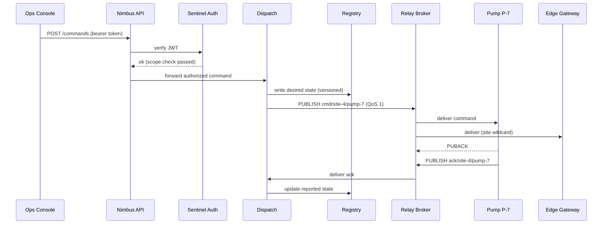

# Cumulus IoT Platform — Command & Telemetry Path HLD

| | |
|---|---|
| Status | Draft 4 |
| Owners | platform-core |
| Last updated | 2026-08-19 |
| Reviewers | ops-tools, firmware |

## 1. Overview

Cumulus is our managed IoT control plane. This document covers the two flows that
account for nearly all production traffic on the platform today: the **operator
command path** (an operator changes a device's desired state from the Ops Console)
and the **OTA firmware rollout path** (a staged fleet update pushed through the same
transport). Telemetry ingest is out of scope here and is covered in the ingest HLD.

The design goal for both flows is the same: every state change flows through the
device-shadow Registry so that the platform, not the device, is the source of truth
for *desired* state, and devices are the source of truth for *reported* state.
Transport between the cloud and devices is MQTT over TLS on port 8883, brokered by
Relay. Devices never accept inbound connections; everything is device-initiated
subscribe/publish.

Site 4 (the pilot deployment) is used for all examples below. Its device population
is small and intentionally heterogeneous: a Thermostat T-100, a Pump P-7, and an
Edge Gateway that bridges legacy Modbus equipment.

## 2. Component Inventory

| Component | Role | Code |
|---|---|---|
| Ops Console | Operator-facing web UI; issues commands, renders shadow state | https://github.com/doorbuzz-cloud/platform/blob/main/web/console/src/commands/panel.tsx#L48 |
| Nimbus API | Public API gateway; terminates TLS, authenticates callers, routes | https://github.com/doorbuzz-cloud/platform/blob/main/services/nimbus/router.go#L203 |
| Sentinel Auth | Token service; JWT verification and scope checks | https://github.com/doorbuzz-cloud/platform/blob/main/services/sentinel/verify.go#L77 |
| Dispatch | Command service; validates, sequences, and publishes commands | https://github.com/doorbuzz-cloud/platform/blob/main/services/dispatch/handler.go#L112 |
| Registry | Device-shadow store; desired/reported state documents, versioned | https://github.com/doorbuzz-cloud/platform/blob/main/services/registry/shadow.go#L31 |
| Relay | MQTT broker cluster; TLS :8883, QoS 0/1, retained messages | https://github.com/doorbuzz-cloud/platform/blob/main/infra/relay/broker.conf#L9 |
| Thermostat T-100 | Battery-powered HVAC controller; sleepy device | https://github.com/doorbuzz-cloud/firmware/blob/main/t100/main/app_mqtt.c#L164 |
| Pump P-7 | Line-powered pump controller; always connected | https://github.com/doorbuzz-cloud/firmware/blob/main/p7/src/command_loop.cpp#L88 |
| Edge Gateway | Site-local bridge for legacy equipment; subscribes to the site wildcard | https://github.com/doorbuzz-cloud/platform/blob/main/edge/gateway/subscriber.go#L52 |

Topic layout for site 4:

- `cmd/site-4/<device-id>` — commands, published by Dispatch, QoS 1
- `ack/site-4/<device-id>` — acknowledgments, published by devices, QoS 1
- `telemetry/site-4/<device-id>` — periodic reported state (out of scope here)

The Edge Gateway subscribes to `cmd/site-4/#` rather than a per-device topic so it
can shadow-log every command that transits the site; this is also what makes it a
useful debugging tap (see the fan-out discussion in the failure-handling section).

## 3. Operator Command Flow

An operator changes Pump P-7's target flow rate from the Ops Console. The full path:

1. The Console submits `POST /commands` to Nimbus API with the operator's bearer token.
2. Nimbus calls Sentinel to verify the JWT before anything else touches the request.
   Sentinel checks both signature and scope; command writes require the
   `device.write` scope, which is granted only to the `site-operator` and
   `platform-admin` roles. Requests failing the scope check are rejected 403 at the
   gateway and never reach Dispatch.
3. Nimbus forwards the authorized command to Dispatch.
4. Dispatch validates the command against the device's reported capabilities and
   writes the new *desired* state to the Registry. The shadow write is versioned;
   a stale-version write is rejected and surfaces to the Console as a retryable
   conflict.
5. Dispatch publishes the command to Relay on `cmd/site-4/pump-7` at QoS 1,
   `retain` off.
6. Relay fans the message out to every subscriber of the matching topics — for a
   pump command that is Pump P-7 itself and the Edge Gateway (via the site
   wildcard). The Thermostat is not subscribed to pump topics and receives nothing.
7. Pump P-7 executes the command, publishes a broker-level PUBACK for the QoS 1
   delivery, then publishes an application-level acknowledgment on
   `ack/site-4/pump-7` carrying the new reported state. Dispatch consumes the ack
   and updates the Registry's reported document; the Console's open subscription
   picks up the change and closes the loop for the operator.

A note on sleepy devices: the Thermostat T-100 spends most of its life in deep
sleep with the radio off. Relay is configured with persistent sessions
(`clean_session=false`) for battery-class devices, so QoS 1 commands published
while the T-100 sleeps are queued by the broker and delivered on its next wake
window rather than lost. Wake windows are firmware-controlled and currently every
15 minutes; commands to sleepy devices are therefore eventually-consistent by
design, and the Console renders them as "pending delivery" until the ack arrives.

TODO(platform-core): document the max queue depth per persistent session before
Relay starts dropping — firmware team has asked twice.

## 4. OTA Firmware Rollout Flow

OTA reuses the command transport but is driven by the rollout coordinator inside
Dispatch rather than by an operator click. There is deliberately no sequence
diagram for this flow yet; the stages below are normative.

A rollout begins when a release engineer registers a new firmware image with the
Registry (image digest, target hardware revision, minimum battery level). Dispatch
then opens the rollout in **canary stage**: it selects the canary cohort — by
policy, the Edge Gateway plus one device per hardware class at the pilot site —
and publishes an update offer to each canary's command topic at QoS 1. Each device
downloads the image over HTTPS from the artifact store (the broker never carries
image bytes), verifies the digest, flashes, reboots, and publishes a version
report on its ack topic.

Only when every canary reports the new version within the stage window does
Dispatch advance to **fleet stage**, publishing offers in batches of 50 devices
with a 10-minute soak between batches. A failed or silent canary freezes the
rollout in place and pages the release engineer; there is no automatic rollback,
because reverting flashed firmware is itself a rollout.

Delivery failures within any stage are retried with exponential backoff — 1, 4,
then 16 minutes. After the third failed attempt for a given device, the offer is
moved to the rollout's **dead-letter list** and the device is excluded from the
remaining stages; dead-lettered devices appear in the Console's rollout view with
their last error. The retry taxonomy in section 5 applies to OTA offers exactly as
it does to operator commands.

## 5. Failure Handling

Failures are classified at the point where they are first observed:

- **Auth failures** (Sentinel): terminal, never retried; surfaced to the caller
  as 401/403. See the scope discussion in section 3.
- **Validation failures** (Dispatch): terminal; Dispatch checks capability flags
  from the shadow before enqueueing anything, and a command the device cannot
  execute is rejected synchronously with a machine-readable reason.
- **Shadow version conflicts** (Registry): retryable by the caller; the Console
  auto-retries once with a refreshed version before showing an error.
- **Delivery timeouts** (Relay → device): retried with the same 1/4/16-minute
  backoff schedule used by OTA; after the third attempt the command is marked
  undeliverable and the shadow's desired/reported divergence is flagged on the
  device page.
- **Ack timeouts** (device → Dispatch): treated identically to delivery timeouts
  from the operator's point of view, though the underlying cause is usually a
  firmware-side failure after successful delivery. Distinguishing the two cases
  from broker session state is an open item.

The Edge Gateway's wildcard subscription doubles as the site's black-box recorder:
because it sees every command fan-out, its local log is the first artifact pulled
when delivery disputes arise.

## 6. Non-Functional Notes

- **Latency budget**: operator command to PUBACK observed at p50 180ms / p99 900ms
  for line-powered devices at site 4. Sleepy devices are excluded from latency
  SLOs entirely (see the persistent-session note in section 3).
- **Throughput**: Relay is provisioned for 10k concurrent sessions per node; site 4
  uses three. This is not the bottleneck and will not be for years.
- **Security**: mutual TLS between all cloud services; devices authenticate to
  Relay with per-device X.509 certificates rotated annually. Sentinel JWTs expire
  after 15 minutes; the Console silently refreshes.
- **Observability**: every command carries a `trace_id` from Console to ack;
  Dispatch emits one span per stage transition during rollouts.
- **Multi-site**: topic layout is already site-prefixed; nothing in this document
  is site-4-specific except the examples.
